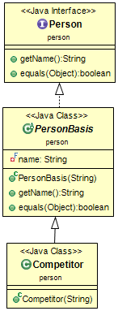
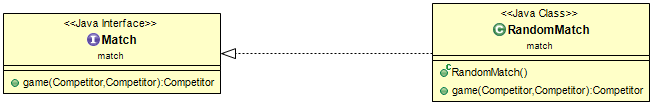
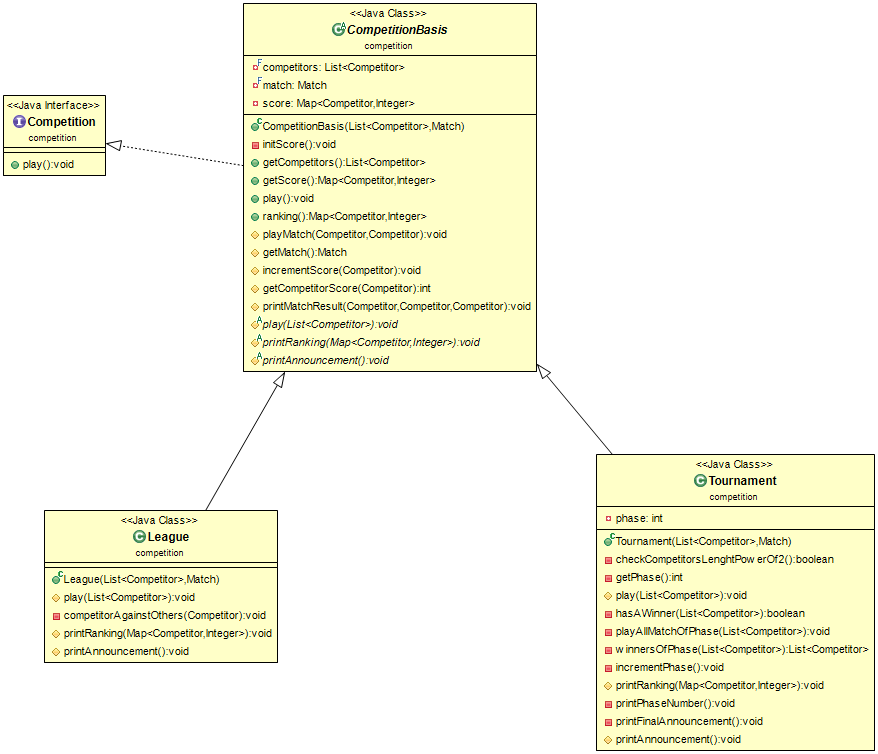
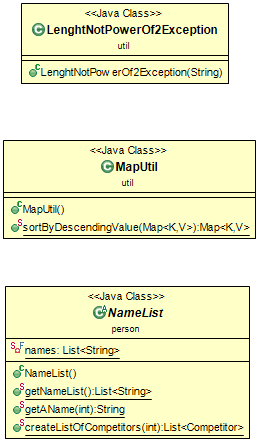

# Sommaire

* [Introduction du projet](#introduction-du-projet) 
* [HowTo](#howto)
    * [Récupération du dépôt](#récupération-du-dépôt)
    * [Génération de la documentation](#génération-de-la-documentation)
    * [Génération de l'archive du projet](#génération-de-larchive-du-projet)
    * [Exécution des fichiers générés](#exécution-des-fichiers-générés)
    * [Exécution des tests](#exécution-des-tests)
    * [Nettoyage des fichiers générés](#nettoyage-des-fichiers-générés)
* [Choix de conception](#choix-de-conception)
  * [Démarche globale durant le projet](#démarche-globale-durant-le-projet)
  * [Person](#person)
    * [Interface Person](#interface-person)
    * [Abstract PersonBasis](#abstract-personbasis)
    * [Competitor](#competitor)
  * [Match](#match)
    * [Interface Match](#interface-match)
    * [RandomMatch](#randommatch)
  * [Competition](#competition)
    * [Interface Competition](#interface-competition)
    * [Abstract CompetitionBasis](#abstract-competitionbasis)
    * [Tournament](#tournament)
    * [League](#league)
  * [Class Util](#class-util)

# Introduction du projet

* Compétitions Sportives v1 :

  Dans cette première partie nous avons mis en place par notre conception la gestion d'une compétition sportive. Deux types de compétition sont possibles.
  
  * Soit une League qui va faire disputer tous les compétiteurs entre-eux avec un match aller et un match retour. Ainsi un classement se fait naturellement par le nombre de victoires.
  
  * Soit un Tournament qui lui fera disputer les compétiteurs durant des phases. Où à chaque phase un compétiteur rencontre un autre compétiteur. Le gagnant peut disputer la phase suivante et le perdant est éliminé du tournoi. Chaque compétiteur peut disputer au plus un seul match par phase et le dernier qui gagne le match de la phase où il restera 2 compétiteurs gagne le tournoi. Ainsi il sera nécessaire de faire participer un nombre qui est une puissance de 2 de compétiteurs et qui est supérieur à 1. Pour permettre le bon fonctionnement et le lancement d'un Tournament.

 Nous utiliserons un seul type de match pour les deux types de compétitions à savoir RandomMatch. Qui prendra un gagant entre deux compétiteurs de manière aléatoire. Il y aura donc pas d'égalité.

  lien vers le sujet v1 : [TP1_competitions.pdf](https://www.fil.univ-lille1.fr/~quinton/coo/projet/competitions.pdf)

# HowTo

## Récupération du dépôt

Pour récupérer le dépôt du projet vous pouvez utilisez soit : 

* HTTPS :
```bash
$ git clone https://gitlab-etu.fil.univ-lille1.fr/pather/pather_larafi_coo.git
```

* SSH :
```bash
$ git clone git@gitlab-etu.fil.univ-lille1.fr:pather/pather_larafi_coo.git
```


## Génération de la documentation

Pour générer la documentation des différents fichiers. Placez-vous dans le répertoire racine du projet et utilisez la commande suivante :

```bash
/pather_larafi_coo$ make doc
```

Ainsi la documentation est générée et se trouve dans le répertoire *doc/*.

## Génération de l'archive du projet

Pour créer l'archive du projet utilisez la commande suivante depuis le répertoire racine du projet :

```bash
/pather_larafi_coo$ make archive
zip projet-pather-larafi-Competition.zip test/match test/competition test/person src/match src/util src/competition src/person src/LeagueMain.java src/TournamentMain.java Makefile README.md manifest_league manifest_tournament test-1.8.1.jar
  adding: test/match/ (stored 0%)
  adding: test/competition/ (stored 0%)
  adding: test/person/ (stored 0%)
  adding: src/match/ (stored 0%)
  adding: src/util/ (stored 0%)
  adding: src/competition/ (stored 0%)
  adding: src/person/ (stored 0%)
  adding: src/LeagueMain.java (deflated 53%)
  adding: src/TournamentMain.java (deflated 59%)
  adding: Makefile (deflated 58%)
  adding: README.md (deflated 66%)
  adding: manifest_league (stored 0%)
  adding: manifest_tournament (stored 0%)
  adding: test-1.8.1.jar (deflated 12%)
```

L'archive du projet portera le nom suivant : *projet-pather-larafi-Competition.zip*

## Exécution des fichiers générés

Tout d'abord utiliser la commande make pour compiler les fichiers nécessaires et produire le fichier league.jar et tournament.jar :

```bash
/pather_larafi_coo$ make
```

Pour exécutez les fichiers :

```bash
/pather_larafi_coo$ java -jar league.jar
```

Et

```bash
/pather_larafi_coo$ java -jar tournament.jar
```

## Exécution des tests

Pour compiler et lancer les tests. Utilisez la commande suivante en vous plaçant dans le répertoire racine du projet : 

```bash
/pather_larafi_coo$ make test
javac -cp test-1.8.1.jar:class -sourcepath src:test test/*/*.java -d classes/
java -jar test-1.8.1.jar -cp classes/ --disable-banner --scan-classpath

╷
├─ JUnit Jupiter ✔
│  ├─ LeagueTest ✔
│  │  ├─ should_PlayMatches_When_Competition() ✔
│  │  ├─ should_Create_A_Competition() ✔
│  │  ├─ competitors_Should_Score_When_Competition() ✔
│  │  ├─ should_Create_Map_Score() ✔
│  │  ├─ should_Create_List_Of_Competitors() ✔
│  │  ├─ should_Initialize_Competitors_In_Score() ✔
│  │  ├─ should_Score_A_Victory_For_Winner_When_Play_Match() ✔
│  │  ├─ should_Create_Match() ✔
│  │  ├─ total_Score_Equal_To_Number_Of_Played_Matchs_With_MockMatch() ✔
│  │  ├─ should_Call_Game_Method_Of_Match_When_PlayMatch() ✔
│  │  ├─ should_Initialize_The_Number_Of_Victories_Of_Each_Competitor_To_0() ✔
│  │  ├─ score_Of_Each_Competitor_Should_Be_Equal_To_Number_Of_Opponents_With_MockMatch() ✔
│  │  ├─ number_Of_Matches_Should_Be_Equal_To_Total_Victories() ✔
│  │  ├─ each_Competitor_Should_Play_Two_Times_Against_All_Other_Competitors() ✔
│  │  ├─ competitors_Should_Have_Score_Same_When_Ranking_With_MockMatch() ✔
│  │  ├─ number_Of_Matches_Should_Be_Equal_To_NbCompetitors_Times_NbCompetitors_Less_One(... ✔
│  │  └─ score_Of_Each_Competitor_Should_Not_Exceed_Two_Times_Number_Of_Opponents() ✔
│  ├─ CompetitorTest ✔
│  │  ├─ should_Create_New_Character() ✔
│  │  └─ two_Characters_With_Different_Names_Should_Not_Be_Equals() ✔
│  ├─ TournamentTest ✔
│  │  ├─ should_PlayMatches_When_Competition() ✔
│  │  ├─ should_Create_A_Competition() ✔
│  │  ├─ competitors_Should_Score_When_Competition() ✔
│  │  ├─ should_Create_Map_Score() ✔
│  │  ├─ should_Create_List_Of_Competitors() ✔
│  │  ├─ should_Initialize_Competitors_In_Score() ✔
│  │  ├─ should_Score_A_Victory_For_Winner_When_Play_Match() ✔
│  │  ├─ should_Create_Match() ✔
│  │  ├─ total_Score_Equal_To_Number_Of_Played_Matchs_With_MockMatch() ✔
│  │  ├─ should_Call_Game_Method_Of_Match_When_PlayMatch() ✔
│  │  ├─ should_Initialize_The_Number_Of_Victories_Of_Each_Competitor_To_0() ✔
│  │  ├─ should_Throw_LenghtNotPowerOf2Competitors_When_NbCompetitors_Not_A_Power_Of_Two(... ✔
│  │  ├─ should_Rank_Players_From_The_Winner_To_Losers() ✔
│  │  └─ total_Score_Should_Be_Equal_To_Number_Of_Number_Of_Opponents() ✔
│  ├─ RandomMatchTest ✔
│  │  ├─ should_Have_A_Single_Winner_After_Contest() ✔
│  │  └─ should_Create_Match() ✔
│  └─ NameListTest ✔
│     ├─ testCreateListOfCompetitors() ✔
│     ├─ testAllNamesAreDifferent() ✔
│     └─ getAName() ✔
└─ JUnit Vintage ✔

Test run finished after 340 ms
[         7 containers found      ]
[         0 containers skipped    ]
[         7 containers started    ]
[         0 containers aborted    ]
[         7 containers successful ]
[         0 containers failed     ]
[        38 tests found           ]
[         0 tests skipped         ]
[        38 tests started         ]
[         0 tests aborted         ]
[        38 tests successful      ]
[         0 tests failed          ]
```

## Nettoyage des fichiers générés

Pour nettoyer les répertoires des différents fichiers qui ont pu être générés. Vous pouvez utilisez les commandes suivante à partir du répertoire racine du projet :

```bash
/pather_larafi_coo$ make clean
rm -rf classes/
rm -f league.jar tournament.jar
```

Ou pour supprimer le répertoire doc et l'archive en plus de précédemment :

```bash
/pather_larafi_coo$ make cleanall
rm -rf classes/
rm -f league.jar tournament.jar
rm -rf doc/
rm -f projet-pather-larafi-Competition.zip
```

# Choix de conception

## Démarche globale durant le projet

* Nous avons tenté d'appliquer dans l'ensemble du projet la loi de Déméter qui consiste en partie à faire communiquer chaque objet sans passer par des intérmediaires. Cela permet donc de s'assurer de la maintenabilité du projet en cas d'évolution.

* Nous avons veillé à ce que le nombre de lignes de code de chaque méthode soit comprise entre 2 et 4 (exceptionnellement 5 pour certaines) afin d'avoir un code plus clair pour chaque méthode et de faire en sorte que celles-ci puissent répondre au principe de responsabilité unique. 

* Nous avons choisi de ne pas avoir de méthodes de plus de deux paramètres afin de rendre les tests plus simple à réaliser et à comprendre. Cela réduit par ailleurs le nombre de tests à faire.

* Nous avons choisi de rendre le plus possible privé/protegé les méthodes utilitaires aux 
méthodes principales (elles publiques) car nous avons choisi de protéger aux mieux les méthodes qui modifient les attributs. Si certaines sont publics c'est pour l'utilisation dans les tests.

* Nous avons appliqué le plus possible le développement du projet en Test Driven Development (TDD) et en appliquant des méthodes de test unitaires
## Person

Voici le diagramme UML autour de l'interface [*__Person__*](https://gitlab-etu.fil.univ-lille1.fr/pather/pather_larafi_coo/-/tree/master/src/person) :



### Interface Person

L'interface Person reprendre toutes les méthodes qui seront commnunes à tout type d'implémentation d'une personne au plus haut niveau d'abstraction. La responsabilité de l'interface Person est donc ici de présenter les méthodes primaires à toutes entités actuelles et futurs de personnes.

### Abstract PersonBasis

Ici nous avons fait le choix de faire une classe abstraite PersonBasis qui reprend les bases de l'interace Person. Et qui permet une couche d'abstraction à Competitor. Car nous pouvons définir un compétiteur comme une personne pour qui l'on souhaite juste connaître le nom. Pour pouvoir le différencier d'autres competitor. Et dans le cas d'évolution où par exemple une autre entité que competitor qui pourrait se définir également par une personne. Alors elle serait une sous classe à PersonBasis. Et de fait partager les méthodes et attributs primaires et nécessaires à l'implémentation d'un personne. Comme par exemple obtenir son nom ou la comparer à une autre Person de la même entité qu'elle ou de toutes autres sous classes de PersonBasis.

### Competitor

Concernant la classe Competitor, comme expliqué plus haut nous faisons le choix de la mettre en sous classe de la classe abstract PersonBasis. Dans le cas d'un competiteur, il n'est pas nécessaire actuellement de faire d'autres méthodes que celle définies dans la classe mère PersonBasis. Ainsi nous passons juste le nom voulu pour notre compétiteur dans le constructeur de Competitor. Et nous utilisons au besoin les méthodes de la classe PersonBasis.

## Match

Voici le diagramme UML autour de l'interface [*__Match__*](https://gitlab-etu.fil.univ-lille1.fr/pather/pather_larafi_coo/-/tree/master/src/match) :



### Interface Match

Nous prennons le choix de faire une interface Match qui permet de mettre en évidence ce qu'on attend de tout type de match. C'est-à-dire qu'il permet à partir de deux compétiteurs d'obtenir un gagnant en retour. Cette responsabilité propre à Match se fait donc par la méthode *__game__* qui à partir de deux compétiteurs permettra d'obtenir un seul gagnant.

### RandomMatch

Ainsi dans notre définition de la classe RandomMatch on retrouve la méthode *__game__* qui doit donc être conforme au rôle attendu de part sa dépendance à l'interface Match. Cette méthode nous permet donc comme expliqué à obtenir un gagnant entre deux compétiteurs donnés. Et spécifiquement à la classe RandomMatch. On obtient ce vainqueur de manière aléatoire entre les deux compétiteurs. La classe nous sert donc d'utilitaire pour y parvenir.

Au vue du fonctionnement global attendu des compétitions. Il n'est pas nécessaire dans le contexte actuel d'instancier des RandomMatch pour permettre la rencontre entre deux compétiteurs et obtenir le gagnant. Nous faisons donc le choix de simplement pouvoir donner un type de match à la construction d'une compétition et ainsi pouvoir faire le lien avec la méthode *__game__* comme nous verrons plus bas.

## Competition

Voici le diagramme UML autour de l'interface [*__Competition__*](https://gitlab-etu.fil.univ-lille1.fr/pather/pather_larafi_coo/-/tree/master/src/competition) :



### Interface Competition

Le comportement commun d'une compétition est qu'elle déroule principalement des affrontements entre des compétiteurs. L'interface Competition reprend donc ce comportement sous la méthode *__play()__* qui est responsable du déroulement des affrontements jusqu'à une possible fin.

### Abstract CompetitionBasis

La classe abstraite CompetitionBasis reprend quant à elle les bases d'une compétition du sujet, à savoir une liste de compétiteurs fixée au départ et un type de match en particulier. 

Puisqu'un classement entre les compétiteurs est imposé, il est donc judicieux de connaitre 
le nombre de gains de chacun. La table de hachage score en attribut sert à ce que l'on note
au fur et à mesure des affrontements entre deux compétiteurs (*__playMatch__*) le gagnant du match.
Cela rend donc mieux traçable au niveau des tests l'évolution (intrinsèque) de la compétition.

En appliquant le principe de fermeture à la modification des classes, il en convient donc que la classe ne se limite qu'aux gains et non aux pertes. Il faudra donc dans ce cas étendre CompétitionBasis pour satisfaire cette dernière condition. 

Nous utilisons le principe d'inversion des dépendances en faisant directement appel à 
la méthode *__game__* de Match (interface) dans *__playMatch__*. Cela augmente donc la maintenabilité du projet car quelle que soit le changement de la méthode *__game__* et le type de Match choisi la conception *__playMatch__* reste inchangée et CompetitionBasis de même.

### Tournament

La classe tournament représente un tournoi et étend donc CompétitionBasis.
Puisque l'évolution (intrinsèque) des affrontements se fait selon les gagnants
pour chaque affrontement et ce de manière successive. Il était donc judicieux de mettre 
un compteur de tours pour suivre au mieux la compétition.
Cela nous a donc permis de situer les gagnants à chaque tour/phase *__winnersOfPhase__*.

Cette conception permet ainsi d'être le plus précis possible au niveau des tests
pour situer les joueurs au niveau du classement.

Nous pouvons noter que les classes filles étendues respectent le principe de fermeture 
à la modification car nous n'avons réecrit aucune méthode public non abstraite.

### League

Le type de compétition league étend la classe abstraite CompetitionBasis. 

La logique métier de la méthode principale *__plays__*. (surchargé par une liste de compétiteur) revient à faire jouer chaque compétiteur entre eux. Il s'agit donc de faire jouer chaque compétiteur contre ses opposants. Cette conception nous a donc permis de réduire le nombre de méthodes à deux dont play qui encapsule la logique métier sous une méthode *__competitorAgainstOthers__*. Et qui permet donc de surcroît de réduire le nombre de tests et de rendre ceux-ci mieux ciblés et plus précis. 

## Class Util

Voici le diagramme UML des classes MapUtil, LenghtNotPowerOf2Exception et NameList  [*__MapUtil, LenghtNotPowerOf2Exception et NameList__*](https://gitlab-etu.fil.univ-lille1.fr/pather/pather_larafi_coo/-/tree/master/src/util) :



* MapUtil :

    MapUtil va nous permettre la définition d'une méthode *__sortByDescendingValue__* qui permet d'obtenir un objet du type Map rangé par ordre décroissant des valeurs de ses clés.

* LenghtNotPowerOf2Exception :

    Classe que l'on utilise pour définir notre exception au fait qu'une liste ne soit pas de longueur d'une puissance de 2.

* NameList :

    Nous avons définis une classe NameList dans laquelle est défini une liste final static de 200 Strings qui correpond à des noms français.
    Que l'on utilise afin d'obtenir des noms pour construire nos compétiteurs. Ainsi la méthode *__getNameList__* retourne cette liste de 200 String. La méthode *__getAName__* retourne un string de cette liste. Et *__createListOfCompetitors__* retourne une liste de comptiteurs avec un nom contenu dans la liste des noms.