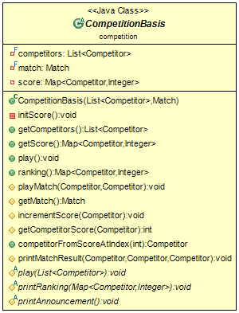
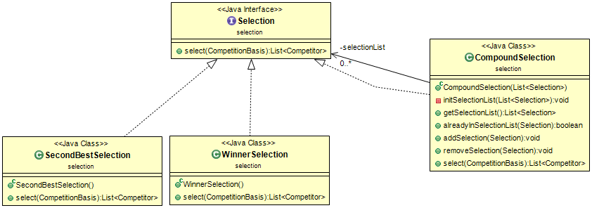
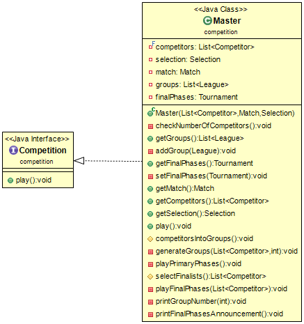
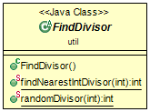
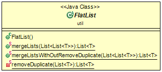
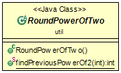
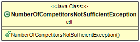

# Sommaire

* [Introduction du projet](#introduction-du-projet) 
* [HowTo](#howto)
    * [Récupération du dépôt](#récupération-du-dépôt)
    * [Génération de la documentation](#génération-de-la-documentation)
    * [Génération de l'archive du projet](#génération-de-larchive-du-projet)
    * [Exécution des fichiers générés](#exécution-des-fichiers-générés)
    * [Exécution des tests](#exécution-des-tests)
    * [Nettoyage des fichiers générés](#nettoyage-des-fichiers-générés)
* [Choix de conception](#choix-de-conception)
  * [Démarche globale durant le projet](#démarche-globale-durant-le-projet)
  * [Modification v1](#modification-v1)
    * [CompetitionBasis](#competitionbasis)
  * [Selection](#selection)
    * [WinnerSelection](#winnerselection)
    * [SecondBestSelection](#secondbestselection)
    * [CompoundSelection](#compoundselection)
  * [Competition](#competition)
    * [Master](#master)
  * [Class Util](#class-util)
    * [FindDivisor](#findivisor)
    * [FlatList](#flatlist)
    * [RoundPowerOfTwo](#roundpoweroftwo)
    * [NumberOfCompetitorsNotSufficientException](#numberofcompetitornotsufficientexception)

# Introduction du projet

* Compétitions Sportives v2 :

  Dans cette deuxième partie du projet nous avons ajouté un type de competition qui est le type Master. Ce nouveau type est divisé en deux parties :

    * Phase de poule
    * Phase finale

  Les phases de poules sont des Leagues et la phase finale est un tournoi.
  
  Ainsi il est nécessaire pour les phases de poules de répartir les compétiteurs dans des Leagues. A la suite desquelles nous allons sélectionner en fonction d'une ou plusieurs méthodes de sélection, des compétiteurs en fonction des résultats ou tout autre critère que l'on souhaite. Les compétiteurs sélectionnés seront qualifiés pour participer à la phase finale qui est donc un tournoi à élimination direct. Il est donc nécessaire que quelque soit les méthodes de sélection utilisées. Il y aura obligatoirement un nombre de compétiteurs qui est une puissance de 2.

  Le compétiteur qui remporte la finale du tournoi de la phase finale gagne le Master. Quelque soit le nombre total de match qu'il a pu remporter au cours de l'ensemble du Master. C'est-à-dire son score cumulé phase de poule et phase finale. Par définition d'un tournament il sera par contre le compétiteur ayant remporté le plus de match durant la phase finale.

Comme lors de la v1 de ce projet, nous utiliserons également ici un seul type de match à savoir RandomMatch. Qui prend un gagnant entre deux compétiteurs de manière aléatoire. Il n'y aura donc pas d'égalité.

lien vers le sujet v2 : [TP2_competitions.pdf](https://www.fil.univ-lille1.fr/~quinton/coo/projet/competitionsV2.pdf)

# HowTo

## Récupération du dépôt

Pour récupérer le dépôt du projet vous pouvez utilisez soit : 

* HTTPS :
```bash
$ git clone https://gitlab-etu.fil.univ-lille1.fr/pather/pather_larafi_coo.git
```

* SSH :
```bash
$ git clone git@gitlab-etu.fil.univ-lille1.fr:pather/pather_larafi_coo.git
```


## Génération de la documentation

Pour générer la documentation des différents fichiers. Placez-vous dans le répertoire racine du projet et utilisez la commande suivante :

```bash
/pather_larafi_coo$ make doc
```

Ainsi la documentation est générée et se trouve dans le répertoire *doc/*.

## Génération de l'archive du projet

Pour créer l'archive du projet utilisez la commande suivante depuis le répertoire racine du projet :

```bash
/pather_larafi_coo$ make archive
zip projet-pather-larafi-Competition.zip src/*/* test/*/* img/* Makefile README.md README_v1.md README_v2.md manifest_league manifest_tournament manifest_master test-1.8.1.jar
  adding: src/competition/Competition.java (deflated 34%)
  adding: src/competition/CompetitionBasis.java (deflated 70%)
  adding: src/competition/League.java (deflated 64%)
  adding: src/competition/Master.java (deflated 71%)
  adding: src/competition/Tournament.java (deflated 73%)
  adding: src/match/Match.java (deflated 40%)
  adding: src/match/RandomMatch.java (deflated 52%)
  adding: src/person/Competitor.java (deflated 38%)
  adding: src/person/NameList.java (deflated 61%)
  adding: src/person/Person.java (deflated 33%)
  adding: src/person/PersonBasis.java (deflated 56%)
  adding: src/selection/CompoundSelection.java (deflated 70%)
  adding: src/selection/SecondBestSelection.java (deflated 60%)
  adding: src/selection/Selection.java (deflated 54%)
  adding: src/selection/WinnerSelection.java (deflated 59%)
  adding: src/util/FindDivisor.java (deflated 64%)
  adding: src/util/FlatList.java (deflated 50%)
  adding: src/util/LenghtNotPowerOf2Exception.java (deflated 40%)
  adding: src/util/MapUtil.java (deflated 61%)
  adding: src/util/NumberOfCompetitorsNotSufficientException.java (deflated 33%)
  adding: src/util/RoundPowerOfTwo.java (deflated 45%)
  adding: test/competition/CompetitionBasisTest.java (deflated 76%)
  adding: test/competition/LeagueTest.java (deflated 72%)
  adding: test/competition/MasterTest.java (deflated 74%)
  adding: test/competition/TournamentTest.java (deflated 72%)
  adding: test/match/MatchTest.java (deflated 55%)
  adding: test/match/MockMatch.java (deflated 67%)
  adding: test/match/RandomMatchTest.java (deflated 40%)
  adding: test/person/CompetitorTest.java (deflated 39%)
  adding: test/person/NameListTest.java (deflated 62%)
  adding: test/person/PersonBasisTest.java (deflated 58%)
  adding: test/selection/CompoundSelectionTest.java (deflated 73%)
  adding: test/selection/SecondBestSelectionTest.java (deflated 66%)
  adding: test/selection/SelectionTest.java (deflated 69%)
  adding: test/selection/SingleSelectionTest.java (deflated 57%)
  adding: test/selection/WinnerSelectionTest.java (deflated 59%)
  adding: test/util/FindDivisorTest.java (deflated 75%)
  adding: test/util/FlatListTest.java (deflated 67%)
  adding: test/util/RoundPowerOfTwoTest.java (deflated 70%)
  adding: img/competitionBasis.png (deflated 5%)
  adding: img/competition_uml.png (deflated 13%)
  adding: img/master.png (deflated 4%)
  adding: img/match_uml.png (deflated 4%)
  adding: img/person_uml.png (deflated 5%)
  adding: img/selection.png (deflated 9%)
  adding: img/util_uml.png (deflated 8%)
  adding: Makefile (deflated 61%)
  adding: README.md (deflated 39%)
  adding: README_v1.md (deflated 69%)
  adding: README_v2.md (deflated 63%)
  adding: manifest_league (stored 0%)
  adding: manifest_tournament (stored 0%)
  adding: manifest_master (stored 0%)
  adding: test-1.8.1.jar (deflated 12%)
```

L'archive du projet portera le nom suivant : *projet-pather-larafi-Competition.zip*

## Exécution des fichiers générés

Tout d'abord utiliser la commande make pour compiler les fichiers nécessaires et produire le fichier master.jar :

```bash
/pather_larafi_coo$ make
```

Pour exécutez le fichier :

```bash
/pather_larafi_coo$ java -jar master.jar
```

Pour league.jar et tournament.jar voir [README_v1.md](README_v1.md#exécution-des-fichiers-générés)

## Exécution des tests

Pour compiler et lancer les tests. Utilisez la commande suivante en vous plaçant dans le répertoire racine du projet : 

```bash
/pather_larafi_coo$ make test
javac -cp test-1.8.1.jar:class -sourcepath src:test test/*/*.java -d classes/
java -jar test-1.8.1.jar -cp classes/ --disable-banner --scan-classpath

╷
├─ JUnit Jupiter ✔
│  ├─ RoundPowerOfTwoTest ✔
│  │  ├─ Should_return_the_same_number_If_Number_is_already_power_Of_Two() ✔
│  │  └─ Should_round_to_the_nearest_previous_power_of_Two() ✔
│  ├─ CompoundSelectionTest ✔
│  │  ├─ Select_in_a_LeagueWithNoCompetitors_return_Empty_Array_After_PlayMethod_Called() ✔
│  │  ├─ Select_in_a_Not_Played_LeagueWithNoCompetitors_return_Empty_Array() ✔
│  │  ├─ Select_in_a_played_LeagueWithNoCompetitors_throw_Nothing() ✔
│  │  ├─ addSelection_Should_not_add_a_Given_SelectionType_That_is_Already_contains_in_th... ✔
│  │  ├─ setSelection_call_in_the_constructor_remove_the_duplicates_selection_if_there_is... ✔
│  │  ├─ addSelection_Should_Add_a_given_SelectionType_in_the_List_of_SelectionList_If_Sh... ✔
│  │  ├─ remove_Selection_Should_Remove_a_Given_SelectionType_in_the_List_Of_Selection_In... ✔
│  │  ├─ second_Best_Of_Competition_Should_Be_In_Selected_List() ✔
│  │  ├─ Select_Should_return_only_one_competitor_if_there_is_less_than_two_competitors() ✔
│  │  └─ winner_Of_Competition_Should_Be_In_Selected_List() ✔
│  ├─ LeagueTest ✔
│  │  ├─ competitorFromScoreAtIndex_return_the_correct_competitor_from_the_ranking_map() ✔
│  │  ├─ should_PlayMatches_When_Competition() ✔
│  │  ├─ should_Create_A_Competition() ✔
│  │  ├─ competitors_Should_Score_When_Competition() ✔
│  │  ├─ competitorFromScoreAtIndex_return_the_last_competitor_from_the_ranking_map_If_Gi... ✔
│  │  ├─ should_Create_Map_Score() ✔
│  │  ├─ should_Create_List_Of_Competitors() ✔
│  │  ├─ should_Initialize_Competitors_In_Score() ✔
│  │  ├─ should_Score_A_Victory_For_Winner_When_Play_Match() ✔
│  │  ├─ should_Create_Match() ✔
│  │  ├─ total_Score_Equal_To_Number_Of_Played_Matchs_With_MockMatch() ✔
│  │  ├─ should_Call_Game_Method_Of_Match_When_PlayMatch() ✔
│  │  ├─ should_Initialize_The_Number_Of_Victories_Of_Each_Competitor_To_0() ✔
│  │  ├─ score_Of_Each_Competitor_Should_Be_Equal_To_Number_Of_Opponents_With_MockMatch() ✔
│  │  ├─ number_Of_Matches_Should_Be_Equal_To_Total_Victories() ✔
│  │  ├─ each_Competitor_Should_Play_Two_Times_Against_All_Other_Competitors() ✔
│  │  ├─ competitors_Should_Have_Score_Same_When_Ranking_With_MockMatch() ✔
│  │  ├─ number_Of_Matches_Should_Be_Equal_To_NbCompetitors_Times_NbCompetitors_Less_One(... ✔
│  │  └─ score_Of_Each_Competitor_Should_Not_Exceed_Two_Times_Number_Of_Opponents() ✔
│  ├─ CompetitorTest ✔
│  │  ├─ should_Create_New_Character() ✔
│  │  └─ two_Characters_With_Different_Names_Should_Not_Be_Equals() ✔
│  ├─ FindDivisorTest ✔
│  │  ├─ findNearestIntDivisor_Should_return_0_if_0_given() ✔
│  │  ├─ findNearestIntDivisor_Should_Give_The_Nearest_Int_Divisor_If_Divisor_Different_O... ✔
│  │  ├─ randomDivisor_Should_return_Number_in_a_Range_if_given_number_is_2() ✔
│  │  ├─ randomDivisor_Should_return_Number_in_a_Range_if_given_number_is_3() ✔
│  │  ├─ randomDivisor_Should_return_Number_in_a_Range_if_given_number_is_5() ✔
│  │  ├─ randomDivisor_Should_return_Number_in_a_Range_if_given_number_is_N() ✔
│  │  └─ findNearestIntDivisor_Should_return_1_if_1_given() ✔
│  ├─ SecondBestSelectionTest ✔
│  │  ├─ Select_in_a_LeagueWithNoCompetitors_return_Empty_Array_After_PlayMethod_Called() ✔
│  │  ├─ Select_in_a_Not_Played_LeagueWithNoCompetitors_return_Empty_Array() ✔
│  │  ├─ Select_in_a_played_LeagueWithNoCompetitors_throw_Nothing() ✔
│  │  ├─ list_Of_Finalists_Should_Contain_Only_One_Competitor() ✔
│  │  ├─ Select_should_return_empty_array_if_there_is_less_than_two_competitors() ✔
│  │  └─ list_Of_Finalists_Should_Contain_Second_Best_Competitor_Of_Competition() ✔
│  ├─ MasterTest ✔
│  │  ├─ All_Competitors_Should_Be_in_A_Group_After_competitorsIntoGroups_Called() ✔
│  │  ├─ List_Of_Zero_Competitors_Should_Throws_Exception() ✔
│  │  ├─ List_Of_Negative_Number_Competitors_Should_Throws_Exception() ✔
│  │  ├─ competitorsIntoGroups_Should_Generate_A_Positive_Number_Of_League_Less_Than_Numb... ✔
│  │  ├─ play_method_call_should_call_playFinalPhases() ✔
│  │  ├─ play_method_call_should_call_CompetitorsIntoGroups_method() ✔
│  │  ├─ selectFinalists_Should_Always_Return_a_List_With_Length_Power_Of_2() ✔
│  │  ├─ play_method_call_should_play_all_groups() ✔
│  │  ├─ Play_method_call_should_throw_nothing() ✔
│  │  ├─ competitorsIntoGroups_Should_Generate_N_Groups_Formula_Verify() ✔
│  │  ├─ competitorsIntoGroups_Should_GenerateGroups_and_Add_Them_To_GroupsList() ✔
│  │  └─ sumscore_of_each_groups_must_be_equal_to_zero_if_play_method_not_called() ✔
│  ├─ FlatListTest ✔
│  │  ├─ Frequency_Of_element_WithOUTRemoveDuplicate_in_return_list_should_be_SUP_to_One(... ✔
│  │  ├─ Should_Merge_All_Lists_in_the_given_List_in_One_List() ✔
│  │  ├─ mergeList_return_an_instance_of_List_and_Not_List_of_List() ✔
│  │  ├─ Frequency_Of_element_WithRemoveDuplicate_in_return_list_should_be_equal_to_One() ✔
│  │  └─ Should_not_contains_List_object_of_original_List_element() ✔
│  ├─ TournamentTest ✔
│  │  ├─ competitorFromScoreAtIndex_return_the_correct_competitor_from_the_ranking_map() ✔
│  │  ├─ should_PlayMatches_When_Competition() ✔
│  │  ├─ should_Create_A_Competition() ✔
│  │  ├─ competitors_Should_Score_When_Competition() ✔
│  │  ├─ competitorFromScoreAtIndex_return_the_last_competitor_from_the_ranking_map_If_Gi... ✔
│  │  ├─ should_Create_Map_Score() ✔
│  │  ├─ should_Create_List_Of_Competitors() ✔
│  │  ├─ should_Initialize_Competitors_In_Score() ✔
│  │  ├─ should_Score_A_Victory_For_Winner_When_Play_Match() ✔
│  │  ├─ should_Create_Match() ✔
│  │  ├─ total_Score_Equal_To_Number_Of_Played_Matchs_With_MockMatch() ✔
│  │  ├─ should_Call_Game_Method_Of_Match_When_PlayMatch() ✔
│  │  ├─ should_Initialize_The_Number_Of_Victories_Of_Each_Competitor_To_0() ✔
│  │  ├─ should_Throw_LenghtNotPowerOf2Competitors_When_NbCompetitors_Not_A_Power_Of_Two(... ✔
│  │  ├─ should_Rank_Players_From_The_Winner_To_Losers() ✔
│  │  └─ total_Score_Should_Be_Equal_To_Number_Of_Number_Of_Opponents() ✔
│  ├─ RandomMatchTest ✔
│  │  ├─ should_Have_A_Single_Winner_After_Contest() ✔
│  │  └─ should_Create_Match() ✔
│  ├─ WinnerSelectionTest ✔
│  │  ├─ Select_in_a_LeagueWithNoCompetitors_return_Empty_Array_After_PlayMethod_Called() ✔
│  │  ├─ Select_in_a_Not_Played_LeagueWithNoCompetitors_return_Empty_Array() ✔
│  │  ├─ Select_in_a_played_LeagueWithNoCompetitors_throw_Nothing() ✔
│  │  ├─ list_Of_Finalists_Should_Contain_Only_One_Competitor() ✔
│  │  └─ list_Of_Finalists_Should_Contain_Winner_Of_Competition() ✔
│  └─ NameListTest ✔
│     ├─ testGetAName() ✔
│     ├─ testCreateListOfCompetitors() ✔
│     └─ testAllNamesAreDifferent() ✔
└─ JUnit Vintage ✔

Test run finished after 688 ms
[        14 containers found      ]
[         0 containers skipped    ]
[        14 containers started    ]
[         0 containers aborted    ]
[        14 containers successful ]
[         0 containers failed     ]
[        89 tests found           ]
[         0 tests skipped         ]
[        89 tests started         ]
[         0 tests aborted         ]
[        89 tests successful      ]
[         0 tests failed          ]
```

## Nettoyage des fichiers générés

Pour nettoyer les répertoires des différents fichiers qui ont pu être générés. Vous pouvez utilisez les commandes suivante à partir du répertoire racine du projet :

```bash
/pather_larafi_coo$ make clean
rm -rf classes/
rm -f league.jar tournament.jar master.jar
```

Ou pour supprimer le répertoire doc et l'archive en plus de précédemment :

```bash
/pather_larafi_coo$ make cleanall
rm -rf classes/
rm -f league.jar tournament.jar master.jar
rm -rf doc/
rm -f projet-pather-larafi-Competition.zip
```

# Choix de conception

## Démarche globale durant le projet

Même démarche que lors de la v1 : Voir [README_v1.md](README_v1.md#démarche-globale-durant-le-projet).

En plus de quoi Nous avons pu constater lors de cette v2 :

- Une meilleure facilité d'application des notions vue durant le semestre. Dès la prise de connaissance du sujet nous avons su proposer une conception qui répond à la fois à ce qui est attendu par le sujet et qui respecte les attentes en terme d'évolution, de modification, d'abstraction, utilisation des design pattern quand cela est intéressant, justifié et utile.

- La qualité et la fluidité de notre méthode de développement en TDD a elle aussi nettement évoluée. Ce qui nous a permis de mieux cerner l'apport de cette méthode dans un projet. En terme de qualité de travail mais également et en gain de temps. Nous arrivons plus rapidement à attribuer les responsabilités pour les classes et méthodes.

## Modification v1

### CompetitionBasis

Voici le diagramme UML de la nouvelle version de [*__CompetitionBasis__*](src/competition/CompetitionBasis.java) :



Nous avons ajouté la methode *__competitorFromScoreAtIndex()__* à la classe CompetitionBasis. Cette méthode va nous permettre à l'aide d'un itérateur de liste. D'obtenir dans la map de résultat obtenu par la méthode *__ranking()__*, le compétiteur à l'index passé en paramètre. Si l'index donné en paramètre est plus grand que la taille de la Map ranking. Alors on retourne le compétiteur au dernier index de celle-ci.

Voir fichier : [CompetitionBasis.java](src/competition/CompetitionBasis.java)

Ainsi nous avons ajouté des tests concernant cette nouvelle méthode dans le fichier de test *__CompetitionBasisTest.java__*.

Voir fichier : [CompetitionBasisTest.java](test/competition/CompetitionBasisTest.java)

## Selection

Voici le diagramme UML autour de l'interface [*__Selection__*](src/selection/Selection.java) :



Le comportement commun d'une Selection est qu'elle permet de départager,choisir des compétiteurs entre eux en fonction de contraintes que l'on choisit. Comme par exemple un nombre de points minimum à avoir ou encore notre position dans le classement d'une compétition.

L'interface *__Selection__* reprend donc ce comportement sous la méthode *__select()__* qui prend en argument une compétition. Et qui est responsable de l'obtention d'une liste de compétiteurs qui respecte, qui rentre dans le ou les critères que le type de sélection demande.

Les classes *__WinnerSelection__* et *__SecondBestSelection__* sont proposés ici pour permettre une démonstration d'un Master. Il est possible de proposer autant de classe qui implémente *__Selection__*, qu'il existe de façon de sélectionner des compétiteurs dans une compétition.

Voir fichier : [Selection.java](src/selection/Selection.java)

### WinnerSelection

La classe *__WinnerSelection__* implémente l'interface *__Selection__*. Effectivement cette classe aura donc une implémentation de la méthode *__select()__* qui va prendre en argument une compétition et qui va nous permettre d'obtenir le gagnant de la compétition donné en argument. C'est-à-dire le compétiteur en première position de la Map retourné par *__ranking()__*. Pour permettre le bon déroulement et la non interruption d'un Master dans le cas où dans une compétition donné en paramètre de *__select()__* aucun gagnant ne s'y trouve (donc cas où moins de un compétiteur est présent dans la compétition) alors au lieu de throw l'exception *__NoSuchElementException__* on retourne une liste vide pour indiquer qu'un compétiteur n'a pu être retenu pour la compétition donné.

Ce qui va permettre par exemple dans le cas où dans une League de phase de poule d'un Master, nous devons sélectionné le second meilleur. Alors qu'un seul compétiteur est présent dans une poule (ce qui peut arriver en fonction de la répartition en phase de poule). De ne pas arrêter le master pour autant mais de tout simplement, considéré qu'aucun compétiteur valide la requête de sélection.

Voir fichier : [WinnerSelection.java](src/selection/WinnerSelection.java)

On ne considère pas le cas d'égalité en terme de points, nous prenons directement le compétiteur en première position du classement. Nous ne gérons également pas le cas où on sélectionne dans une compétition qui n'est pas encore disputer. Ainsi cela va avoir pour effet de prendre le premier compétiteur dans la Map de ranking même si tous les scores sont à 0.

Voir fichier : [CompetitionBasis.java](src/competition/CompetitionBasis.java)

### SecondBestSelection

La classe *__SecondBestSelection__* implémente l'interface *__Selection__*. Cette classe va donc également proposé une implémentation de la méthode *__select()__*. Celle-ci va retourné une liste qui va contenir le compétiteur qui est en deuxième position du classement de la compétition donné en paramètre. Nous ne gérons pas les cas d'égalité en terme de points, nous prenons directement le Bcompétiteur en deuxième position du classement même si tous les scores sont à 0.

On propose également la même démarche que pour *__WinnerSelection__*. A savoir que l'on retourne une liste vide si par exemple une compétition ne contient qu'un compétiteur. Alors il ne peut y avoir de compétiteur en deuxième position du classement. Donc on retourne une liste vide pour éviter l'interruption du Master.

Voir fichier : [SecondBestSelection.java](src/selection/SecondBestSelection.java)

### CompoundSelection

La classe *__CompoundSelection__* qui implémente l'interface *__Selection__* représente une sélection pouvant contenir plusieurs critères de sélection qui implémente *__Selection__*. Ce qui permet d'obtenir le design pattern composite. *__CompoundSelection__* prend donc en paramètre constructeur une liste de *__Selection__*. Ce qui va permettre au travers d'une seule méthode *__select()__*. D'obtenir une liste de compétiteur qui respecte tous les critères de chaque *__Selection__* contenu dans la liste de *__Selection__* donné en constructeur. 

Plus simplement on utilise la méthode *__select()__* de *__CompoundSelection__* qui va elle même appeler chaque méthode *__select()__* des *__Selection__* contenu dans la liste.

On gère le fait que si l'on passe une liste de *__Selection__* au constructeur celui-ci vérifie à l'aide de la méthode *__initSelectionList()__* et *__addSelection__* qui elle utilise *__alreadyInSelectionList()__*. De cette manière on ne retrouve pas deux fois le même type sélection dans la liste des sélections de *__CompoundSelection__*. Ainsi par exemple :

```java
new Compound(List.of(new WinnerSelection, new WinnerSelection));
```

Sera équivalent à :

```java
new Compound(List.of(new WinnerSelection));
``` 

On retrouve les méthodes simples d'un composite à savoir add et remove. Qui vont permettre dans la liste de sélection, l'ajout et la suppression d'un type de *__Selection__* donné.

Dans le cas où on aimerait prendre les deux deuxièmes (égalité de points) s'il y en a. Alors on pourrait faire une classe qui vient étendre *__SecondBestSelection__* et surchargé la méthode de sélection de celle-ci.

Voir fichier : [CompoundSelection.java](src/selection/CompoundSelection.java)

## Competition

Dans cette v2, nous avons ajouté la classe Master qui vient implémentée l'interface *__Competition__*. Etant donné que *__Master__* est un type de competition elle contiendra une méthode *__play()__* qui est commune à toute classe implémentant l'interface *__Competition__*. Et qui permettra donc le déroulement du Master pour obtenir un vainqueur de celui-ci.

### Master

Voici le diagramme UML de la classe [*__Master__*](src/competition/Master.java) :



Pour le bon déroulement du programme on oblige la taille de la liste de compétiteur à être strictement positive. La responsabilité de la méthode play est l'obtention d'un vainqueur. Pour cela cette méthode consiste en trois appels de méthodes :

  * Lancer la répartition des compétiteurs dans des Leagues (les poules)
  * Lancer les League
  * Lancer le tournoi (phase finale) des compétiteurs sélectionnés à la suite des poules

Ainsi une fois la phase finale terminée on a notre vainqueur.

La méthode qui va permettre la répartition est *__competitorsIntoGroups()__* Cette méthode va utiliser *__FindDivisor.findNearestIntDivisor()__* pour trouver un diviseur, puis utiliser *__generateGroups()__* pour générer les Leagues à partir de la liste de compétiteurs et du diviseur. Et si le modulo du nombre de compétiteurs et le diviseur est différent de 0. On ajoute une dernière League avec le restant des compétiteurs qui n'ont pas était ajouter dans une League par *__generateGroups()__*. 

Pour permettre le bon fonctionnement des phases finales. Il est nécessaire que les compétiteurs soit en nombre d'une puissance de 2. Pour être sûr de toujours obtenir un nombre de finaliste d'une puissance de 2. Nous prenons la décision d'arrondir le nombre de finalistes à la puissance de 2 inférieur la plus proche. Si ce nombre n'est pas déjà une puissance de 2.

Pour permettre cela on utilise la méthode *__RoundPowerOfTwo.findPreviousPowerOf2()__* de la classe *__util.RoundPowerOfTwo__*. Sur la liste des finalistes sélectionnés. Ainsi les derniers sélectionnés dans la liste des finalistes peuvent ne pas disputer la phase finale. Car nous prenons les $`n`$ premiers de la liste où $`n`$ est puissance de 2.

Voir fichier : [Master.java](src/competition/Master.java)

## Class Util

### FindDivisor

Voici le diagramme UML de la classe [*__FindDivisor__*](src/util/FindDivisor.java) :



Cette classe va nous permettre de trouver un diviseur pour pouvoir diviser la liste de compétiteurs passé à Master. De façon à pouvoir répartir au mieux les compétiteurs dans différentes leagues.

Voir fichier : [FindDivisor.java](src/util/FindDivisor.java)

### FlatList

Voici le diagramme UML de la classe [*__FlatList__*](src/util/FlatList.java) :



Cette classe contient une méthode pour fusionner une liste de liste donné en paramètre en une seule liste.

Il y a deux versions de cette méthode. Une première où réduit l'occurrence de chaque éléments de la liste à 1 maximum. Donc si un élément est présent x fois il sera présent une seule fois dans la liste fusionné de retour. Cette version avec réduction de l'occurrence permet d'éviter les doublons de sélection de compétiteurs si par exemple il se trouve être premier et avec au moins 2 points dans le cas d'un *__Master__* avec un *__CompoundSelection__* qui contient ses sélections.

Et une seconde version elle au contraitre n'effectue pas cette réduction. Cette dernière sera notamment utilisé pour certains test.

Voir fichier : [FlatList.java](src/util/FlatList.java)

### RoundPowerOfTwo

Voici le diagramme UML de la classe [*__RoundPowerOfTwo__*](src/util/RoundPowerOfTwo.java) :



Cette classe contient une méthode qui nous permet de trouver en donnant une valeur en paramètre. La valeur la plus proche inférieur ou égale qui est une puissance de 2 à celle passé en paramètre.

### NumberOfCompetitorsNotSufficientException

Voici le diagramme UML de la classe [*__NumberOfCompetitorsNotSufficientException__*](src/util/NumberOfCompetitorsNotSufficientException.java) :



Classe d'exception qui nous sert dans le cas de la demande d'une instanciation d'un *__Master__* avec moins d'un compétiteur.

Voir fichier : [NumberOfCompetitorsNotSufficientException.java](src/util/NumberOfCompetitorsNotSufficientException.java)