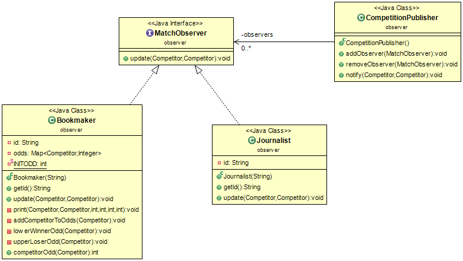

# Sommaire

* [Introduction du projet](#introduction-du-projet) 
* [HowTo](#howto)
    * [Récupération du dépôt](#récupération-du-dépôt)
    * [Génération de la documentation](#génération-de-la-documentation)
    * [Génération de l'archive du projet](#génération-de-larchive-du-projet)
    * [Exécution des fichiers générés](#exécution-des-fichiers-générés)
    * [Exécution des tests](#exécution-des-tests)
    * [Nettoyage des fichiers générés](#nettoyage-des-fichiers-générés)
* [Choix de conception](#choix-de-conception)
  * [Modification v2](#modification-v2)
    * [CompetitionBasis et Master](#competitionbasis-et-master)
  * [MatchObserver](#matchobserver)
    * [Bookmaker](#bookmaker)
    * [Journalist](#journalist)
    * [CompetitionPublisher](#competitionpublisher)

# Introduction du projet

* Compétitions Sportives v3 :
  
lien vers le sujet v3 : [TP3_competitions.pdf](https://www.fil.univ-lille1.fr/~quinton/coo/projet/competitionsV3.pdf)

# HowTo

## Récupération du dépôt

Pour récupérer le dépôt du projet vous pouvez utilisez soit : 

* HTTPS :
```bash
$ git clone https://gitlab-etu.fil.univ-lille1.fr/pather/pather_larafi_coo.git
```

* SSH :
```bash
$ git clone git@gitlab-etu.fil.univ-lille1.fr:pather/pather_larafi_coo.git
```


## Génération de la documentation

Pour générer la documentation des différents fichiers. Placez-vous dans le répertoire racine du projet et utilisez la commande suivante :

```bash
/pather_larafi_coo$ make doc
```

Ainsi la documentation est générée et se trouve dans le répertoire *doc/*.

## Génération de l'archive du projet

Pour créer l'archive du projet utilisez la commande suivante depuis le répertoire racine du projet :

```bash
/pather_larafi_coo$ make archive

```

L'archive du projet portera le nom suivant : *projet-pather-larafi-Competition.zip*

## Exécution des fichiers générés

Tout d'abord utiliser la commande make pour compiler les fichiers nécessaires et produire le fichier observer.jar ainsi que les anciens :

```bash
/pather_larafi_coo$ make
```

Pour exécutez le fichier :

```bash
/pather_larafi_coo$ java -jar observer.jar
```

Pour master.jar, league.jar et tournament.jar voir [README_v1.md](README_v1.md#exécution-des-fichiers-générés) et [README_v2.md](README_v2.md#exécution-des-fichiers-générés)

## Exécution des tests

Pour compiler et lancer les tests. Utilisez la commande suivante en vous plaçant dans le répertoire racine du projet : 

```bash
/pather_larafi_coo$ make test
javac -cp test-1.8.1.jar:class -sourcepath src:test test/*/*.java -d classes/
java -jar test-1.8.1.jar -cp classes/ --disable-banner --scan-classpath

╷
├─ JUnit Jupiter ✔
│  ├─ BookmakerTest ✔
│  │  ├─ odd_Of_Competitor_Should_Not_Be_Under_1() ✔
│  │  ├─ should_Create_Publisher() ✔
│  │  ├─ odd_Of_Winner_Of_Contest_Should_Lower() ✔
│  │  ├─ observer_Should_Assist_To_All_Contests() ✔
│  │  ├─ odd_Of_Competitor_Should_Evolve_Through_Different_Competitions() ✔
│  │  ├─ odd_Of_Competitors_Should_Variy_From_Match_To_Match() ✔
│  │  ├─ should_Create_Observers() ✔
│  │  ├─ odd_Of_Loser_Of_Contest_Should_Upper() ✔
│  │  ├─ should_Create_Competition() ✔
│  │  └─ observer_Should_Assist_To_Different_Competitions() ✔
│  ├─ LeagueTest ✔
│  │  ├─ competitorFromScoreAtIndex_return_the_correct_competitor_from_the_ranking_map() ✔
│  │  ├─ should_PlayMatches_When_Competition() ✔
│  │  ├─ should_Create_A_Competition() ✔
│  │  ├─ competitors_Should_Score_When_Competition() ✔
│  │  ├─ competitorFromScoreAtIndex_return_the_last_competitor_from_the_ranking_map_If_Gi... ✔
│  │  ├─ should_Create_Map_Score() ✔
│  │  ├─ should_Create_List_Of_Competitors() ✔
│  │  ├─ should_Initialize_Competitors_In_Score() ✔
│  │  ├─ should_Score_A_Victory_For_Winner_When_Play_Match() ✔
│  │  ├─ should_Create_Match() ✔
│  │  ├─ total_Score_Equal_To_Number_Of_Played_Matchs_With_MockMatch() ✔
│  │  ├─ should_Call_Game_Method_Of_Match_When_PlayMatch() ✔
│  │  ├─ should_Initialize_The_Number_Of_Victories_Of_Each_Competitor_To_0() ✔
│  │  ├─ score_Of_Each_Competitor_Should_Be_Equal_To_Number_Of_Opponents_With_MockMatch() ✔
│  │  ├─ number_Of_Matches_Should_Be_Equal_To_Total_Victories() ✔
│  │  ├─ each_Competitor_Should_Play_Two_Times_Against_All_Other_Competitors() ✔
│  │  ├─ competitors_Should_Have_Score_Same_When_Ranking_With_MockMatch() ✔
│  │  ├─ number_Of_Matches_Should_Be_Equal_To_NbCompetitors_Times_NbCompetitors_Less_One(... ✔
│  │  └─ score_Of_Each_Competitor_Should_Not_Exceed_Two_Times_Number_Of_Opponents() ✔
│  ├─ CompetitorTest ✔
│  │  ├─ should_Create_New_Character() ✔
│  │  └─ two_Characters_With_Different_Names_Should_Not_Be_Equals() ✔
│  ├─ TournamentTest ✔
│  │  ├─ competitorFromScoreAtIndex_return_the_correct_competitor_from_the_ranking_map() ✔
│  │  ├─ should_PlayMatches_When_Competition() ✔
│  │  ├─ should_Create_A_Competition() ✔
│  │  ├─ competitors_Should_Score_When_Competition() ✔
│  │  ├─ competitorFromScoreAtIndex_return_the_last_competitor_from_the_ranking_map_If_Gi... ✔
│  │  ├─ should_Create_Map_Score() ✔
│  │  ├─ should_Create_List_Of_Competitors() ✔
│  │  ├─ should_Initialize_Competitors_In_Score() ✔
│  │  ├─ should_Score_A_Victory_For_Winner_When_Play_Match() ✔
│  │  ├─ should_Create_Match() ✔
│  │  ├─ total_Score_Equal_To_Number_Of_Played_Matchs_With_MockMatch() ✔
│  │  ├─ should_Call_Game_Method_Of_Match_When_PlayMatch() ✔
│  │  ├─ should_Initialize_The_Number_Of_Victories_Of_Each_Competitor_To_0() ✔
│  │  ├─ should_Throw_LenghtNotPowerOf2Competitors_When_NbCompetitors_Not_A_Power_Of_Two(... ✔
│  │  ├─ should_Rank_Players_From_The_Winner_To_Losers() ✔
│  │  └─ total_Score_Should_Be_Equal_To_Number_Of_Number_Of_Opponents() ✔
│  ├─ RandomMatchTest ✔
│  │  ├─ should_Have_A_Single_Winner_After_Contest() ✔
│  │  └─ should_Create_Match() ✔
│  ├─ NameListTest ✔
│  │  ├─ testGetAName() ✔
│  │  ├─ testCreateListOfCompetitors() ✔
│  │  └─ testAllNamesAreDifferent() ✔
│  ├─ RoundPowerOfTwoTest ✔
│  │  ├─ Should_return_the_same_number_If_Number_is_already_power_Of_Two() ✔
│  │  └─ Should_round_to_the_nearest_previous_power_of_Two() ✔
│  ├─ CompoundSelectionTest ✔
│  │  ├─ Select_in_a_LeagueWithNoCompetitors_return_Empty_Array_After_PlayMethod_Called() ✔
│  │  ├─ Select_in_a_Not_Played_LeagueWithNoCompetitors_return_Empty_Array() ✔
│  │  ├─ Select_in_a_played_LeagueWithNoCompetitors_throw_Nothing() ✔
│  │  ├─ addSelection_Should_not_add_a_Given_SelectionType_That_is_Already_contains_in_th... ✔
│  │  ├─ setSelection_call_in_the_constructor_remove_the_duplicates_selection_if_there_is... ✔
│  │  ├─ addSelection_Should_Add_a_given_SelectionType_in_the_List_of_SelectionList_If_Sh... ✔
│  │  ├─ remove_Selection_Should_Remove_a_Given_SelectionType_in_the_List_Of_Selection_In... ✔
│  │  ├─ second_Best_Of_Competition_Should_Be_In_Selected_List() ✔
│  │  ├─ Select_Should_return_only_one_competitor_if_there_is_less_than_two_competitors() ✔
│  │  └─ winner_Of_Competition_Should_Be_In_Selected_List() ✔
│  ├─ FindDivisorTest ✔
│  │  ├─ findNearestIntDivisor_Should_return_0_if_0_given() ✔
│  │  ├─ findNearestIntDivisor_Should_Give_The_Nearest_Int_Divisor_If_Divisor_Different_O... ✔
│  │  ├─ randomDivisor_Should_return_Number_in_a_Range_if_given_number_is_2() ✔
│  │  ├─ randomDivisor_Should_return_Number_in_a_Range_if_given_number_is_3() ✔
│  │  ├─ randomDivisor_Should_return_Number_in_a_Range_if_given_number_is_5() ✔
│  │  ├─ randomDivisor_Should_return_Number_in_a_Range_if_given_number_is_N() ✔
│  │  └─ findNearestIntDivisor_Should_return_1_if_1_given() ✔
│  ├─ SecondBestSelectionTest ✔
│  │  ├─ Select_in_a_LeagueWithNoCompetitors_return_Empty_Array_After_PlayMethod_Called() ✔
│  │  ├─ Select_in_a_Not_Played_LeagueWithNoCompetitors_return_Empty_Array() ✔
│  │  ├─ Select_in_a_played_LeagueWithNoCompetitors_throw_Nothing() ✔
│  │  ├─ list_Of_Finalists_Should_Contain_Only_One_Competitor() ✔
│  │  ├─ Select_should_return_empty_array_if_there_is_less_than_two_competitors() ✔
│  │  └─ list_Of_Finalists_Should_Contain_Second_Best_Competitor_Of_Competition() ✔
│  ├─ MasterTest ✔
│  │  ├─ All_Competitors_Should_Be_in_A_Group_After_competitorsIntoGroups_Called() ✔
│  │  ├─ List_Of_Zero_Competitors_Should_Throws_Exception() ✔
│  │  ├─ List_Of_Negative_Number_Competitors_Should_Throws_Exception() ✔
│  │  ├─ competitorsIntoGroups_Should_Generate_A_Positive_Number_Of_League_Less_Than_Numb... ✔
│  │  ├─ play_method_call_should_call_playFinalPhases() ✔
│  │  ├─ play_method_call_should_call_CompetitorsIntoGroups_method() ✔
│  │  ├─ selectFinalists_Should_Always_Return_a_List_With_Length_Power_Of_2() ✔
│  │  ├─ play_method_call_should_play_all_groups() ✔
│  │  ├─ Play_method_call_should_throw_nothing() ✔
│  │  ├─ competitorsIntoGroups_Should_Generate_N_Groups_Formula_Verify() ✔
│  │  ├─ competitorsIntoGroups_Should_GenerateGroups_and_Add_Them_To_GroupsList() ✔
│  │  └─ sumscore_of_each_groups_must_be_equal_to_zero_if_play_method_not_called() ✔
│  ├─ FlatListTest ✔
│  │  ├─ Frequency_Of_element_WithOUTRemoveDuplicate_in_return_list_should_be_SUP_to_One(... ✔
│  │  ├─ Should_Merge_All_Lists_in_the_given_List_in_One_List() ✔
│  │  ├─ mergeList_return_an_instance_of_List_and_Not_List_of_List() ✔
│  │  ├─ Frequency_Of_element_WithRemoveDuplicate_in_return_list_should_be_equal_to_One() ✔
│  │  └─ Should_not_contains_List_object_of_original_List_element() ✔
│  └─ WinnerSelectionTest ✔
│     ├─ Select_in_a_LeagueWithNoCompetitors_return_Empty_Array_After_PlayMethod_Called() ✔
│     ├─ Select_in_a_Not_Played_LeagueWithNoCompetitors_return_Empty_Array() ✔
│     ├─ Select_in_a_played_LeagueWithNoCompetitors_throw_Nothing() ✔
│     ├─ list_Of_Finalists_Should_Contain_Only_One_Competitor() ✔
│     └─ list_Of_Finalists_Should_Contain_Winner_Of_Competition() ✔
└─ JUnit Vintage ✔

Test run finished after 691 ms
[        15 containers found      ]
[         0 containers skipped    ]
[        15 containers started    ]
[         0 containers aborted    ]
[        15 containers successful ]
[         0 containers failed     ]
[        99 tests found           ]
[         0 tests skipped         ]
[        99 tests started         ]
[         0 tests aborted         ]
[        99 tests successful      ]
[         0 tests failed          ]
```

## Nettoyage des fichiers générés

Pour nettoyer les répertoires des différents fichiers qui ont pu être générés. Vous pouvez utilisez les commandes suivante à partir du répertoire racine du projet :

```bash
/pather_larafi_coo$ make clean
rm -rf classes/
rm -f league.jar tournament.jar master.jar observer.jar
```

Ou pour supprimer le répertoire doc et l'archive en plus de précédemment :

```bash
/pather_larafi_coo$ make cleanall
rm -rf classes/
rm -f league.jar tournament.jar master.jar observer.jar
rm -rf doc/
rm -f projet-pather-larafi-Competition.zip
```

# Choix de conception

## Modification v2

Des modifications ont été nécessaires pour permettre l'ajout des observateurs dans les différentes compétitions possibiles.
En effet nous avons du déroger au principe OCP en surchargeant les constructeurs des compétitions pour pouvoir ajouter l'objet CompetitionPublisher qui notife chaque observer (Bookmaker et Journalist).

### CompetitionBasis et Master

Nous avons ajouter un deuxième constructeur qui prend en argument un objet CompetitionPublisher. Nous avons donc du surcharger tous les objets des constructeurs qui héritent de CompetitionBasis.

## MatchObserver

Voici le diagramme UML autour de l'interface MatchObserver :



Nous avons implémenter un strategy pattern via MatchObserver qui pour chaque objet héritant de MatchObserver va mettre à jour l'évolution des compétitions auxquelles les MatchObservers assitent. MatchObserver en est donc l'interface.

Un MatchObserver peut assister à plusieurs compétitions différentes

## Bookmaker

Ce type d'Observer a pour responsabilité de fixer des côtes pour chaque Competitors qui est initialement de 5. Il fait évoluer cette côté au fur et à mesure de chaque match entre les compétiteurs auquel il assiste. La côte du gagant diminue de 1 et celle du perdant augmente de 1. La côte minimale est de 1.

## Journalist

Le type Journalist a lui pour responsabilité d'afficher sur la STDOUT les résultats de chaque match au fur et à mesure des rencontres dans les compétitions. Ce qui était la responsabilité auparavant des instances de Competition.

## CompetitionPublisher

La classe CompetitionPublisher vient compléter le pattern observeur-observable entre les MatchObserver et les Competitions. Le CompetitionPublisher est l'objet qui permet la gestion
des observateurs donc ici les Bookmaker et Journalist qui peuvent s'inscrire ou se retirer d'une instance de CompetitionPublisher.

CompetitionPublisher est passé en argument des nouveaux constructeurs des Compétitions. Ansi la méthode notify de CompetitionPublisher permet de signaler à tous les observeteurs inscrit dans le CompetitionPublisher pour une Competition qu'un événement s'est déroulé dans la compétition. Ainsi la méthode update des MatchObserver est appelé par notify ce qui permet au MatchObserver d'effectuer les actions attendus d'eux.